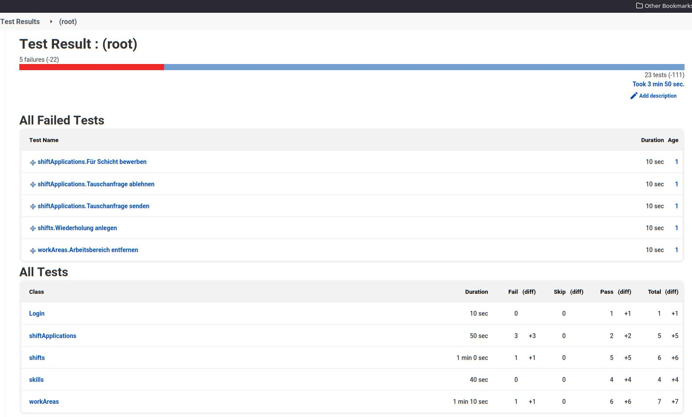

# kr-cli/base:ubuntu18.04-12.0

Image with Ubuntu 18.04 and Node 12

```
node version: v12.22.12 
npm version:     8.10.0 
yarn version:    1.22.18 
debian version:  buster/sid 
user:            root 
git:             git version 2.17.1 
Firefox version: Mozilla Firefox 98.0.2 
python:          Python 3.6.9 
kr-cli:          1.1.0   
``` 


## How to use
### With gui
#### Allow local xhost connections 
```shell
[ -d ~/workspace ] || mkdir ~/workspace
xhost local:root
```
#### Synopsis: 
```shell
[-h] [-o REPORT_NAME [-r RETRIES] IN_DIR
IN_DIR             the directory where your test.html files are located. 
-h                 if this option is present, the tests will run headless
-o REPORT_NAME    specify the filename of the report and the report.xml file that will be generated 
                   the .xml file is in accordance with JUnit format, 
                   which allows for pretty visualizations in e.g JENKINS(using JUnit plugin)
-r RETRIES         kr-cli is pretty unstable (*sigh*), number of times a test-suite is retried after timeout
                   default=2
```
#### Screenshot:

#### Usage:
```shell
headless
docker run -i -v $PWD:/home/e2e -w /home/e2e  -e LOG_OUPUT_OWNER=$(id -u) kr-cli/base:alpine3.16 -r 2 -h -o REPORT_NAME IN_DIR  
with gui
docker run -i --net NETWORK --rm -v $PWD:/home/e2e -w /home/e2e -e DISPLAY --link xvfb kr-cli/base:alpine3.16 -r 2 -h -o REPORT_NAME IN_DIR
```


